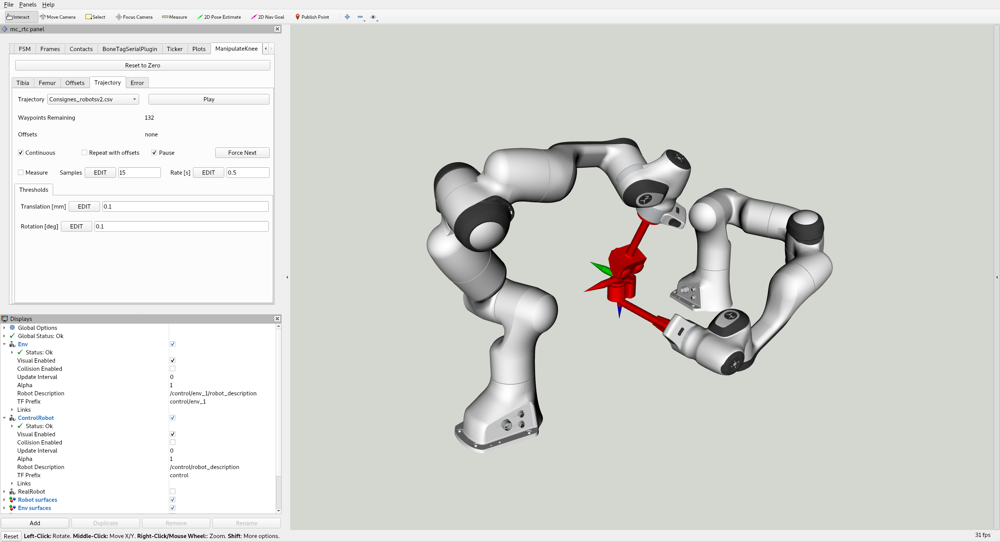
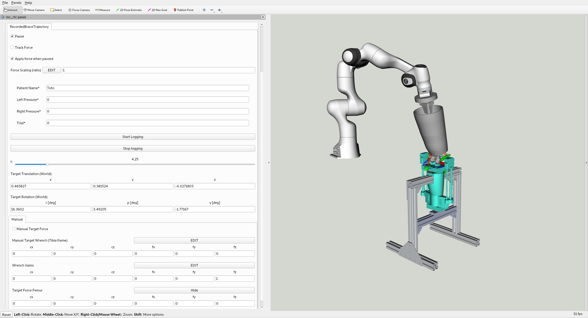

# panda_prosthesis

This repository gathers controllers centered around the development and evaluation of Orthosis medical devices.
It contains two controllers:
- `PandaProsthesis` is a controller dedicated to the evaluation of BoneTag's capacitive sensors. The aim is to provide non-invasive imaging of in-patient knee prosthesis.
- `PandaBrace` is a controller dedicated to the evaluation of experiemental medical Orthosis devices. The aim is to use a robotics setup to quantify how an Orhosis reduces the applied forces on the knee joints.

## Building with superbuild

You can add the [panda-prosthesis-superbuild](https://github.com/arntanguy/panda-prosthesis-superbuild) to your superbuild extension folder:

The following options are available:
- `WITH_PANDA_BRACE:BOOL`: Whether to build the PandaBrace controller and its related dependencies
- `WITH_MC_RTC_ATI_DAQ:BOOL`: [optional in simulation/required for real experiments] Whether to build the `AtiDaq` plugin. This plugin allows to acquire ATI force sensor data plugged to a data acquisition card.
- `WITH_PHIDGET_PRESSURE_SENSOR_PLUGIN:BOOL`: [optional in simulation/required for real experiments] Whether to build the `PhidgetPressureSensor` plugin. This plugin is used to read pressure data from the Orthesis
- `WITH_TACTILE_FORCE_SENSOR_PLUGIN:BOOL`: [optional] Whether to build the `TactileForceSensor` plugin. This allows reading of pressure sensors placed on the surface of the tibia joint.

```sh
cd mc-rtc-superbuild/extensions
git clone https://github.com/arntanguy/panda-prosthesis-superbuild.git
cd ../build
make # clone and build dependencies with superbuild
```

## PandaProsthesis (BoneTag demo)



For details on how to use the `PandaProsthesis` controller, see [PandaProsthesis documentation](doc/PandaProsthesis.md)

## PandaBrace (Lea's Orthesis demo)



For details on how to use the `PandaBrace` controller, see [PandaBrace documentation](doc/PandaBrace.md)
